# SCCM Endpoint Management Lab

This lab documents hands-on work with Microsoft Endpoint Configuration Manager (MECM/SCCM 2509) from a help desk and desktop support perspective. The focus is on the tools a support technician actually uses day to day — finding devices, reading inventory, pushing software, and connecting remotely — not administration for its own sake. Every step in this repository was performed against a live environment and verified before being documented.

The environment is `melvinlab.local` running on Proxmox VE. MEL-SCCM-01 is a Windows Server 2022 machine running SCCM 2509 as the primary site server (site code MEL). MEL-DC-01 is the Windows Server 2022 domain controller for the `melvinlab.local` domain. MEL-CL-01 is a Windows 11 client joined to the domain. All three machines communicate over the same subnet and are managed through a single Configuration Manager console.

The organizing principle is the help desk workflow. SCCM is a tool that support staff inherit on day one — it is already installed, already configured, and they are expected to use it. Each phase of this lab covers one category of support work that SCCM enables, building from the foundation up. Phase 1 establishes the baseline: getting clients enrolled and visible in the console, because nothing else is possible until a device shows up there.

---

## Table of Contents

- [Phase 1: Client Enrollment](#phase-1--client-enrollment)
- [Phase 2: Device Lookup & Inventory](#phase-2--device-lookup--inventory)
- [Phase 3: Remote Control](#phase-3--remote-control)
- [Phase 4: Software Deployment](#phase-4--software-deployment)
- [Phase 5: Software Center (End-User View)](#phase-5--software-center-end-user-view)

---

## Phase 1 — Client Enrollment

Before any support work can be done through SCCM, the devices you are supporting have to appear in the console. A machine that has never had the Configuration Manager client installed is invisible — you cannot inventory it, remote into it, or deploy software to it. This phase walks through enrolling MEL-DC-01 and MEL-CL-01 into the site using Client Push Installation, starting from nothing but a live site and a domain.

### Step 1 — Confirming the Site Is Live

The first stop is Administration → Site Configuration → Sites in the Configuration Manager console. The Sites page shows every primary and secondary site registered to this hierarchy. MEL-SCCM-01 is listed as the Melvin Lab Primary Site with site code MEL and status Active — confirming the site server is healthy and ready to receive clients before anything else is touched.

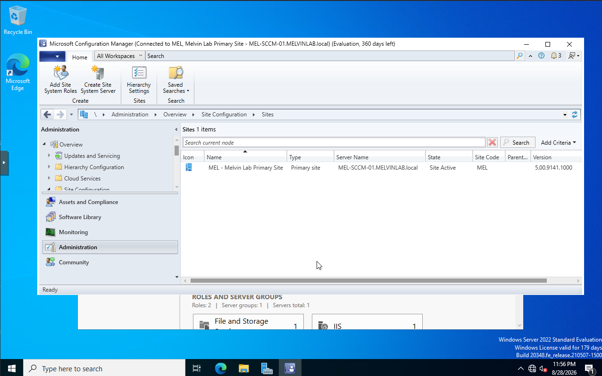

### Step 2 — Configuring Client Push Installation

Right-clicking site MEL and selecting Client Installation Settings → Client Push Installation opens the properties dialog. The Accounts tab is where the credentials that SCCM will use to push the client agent onto remote machines are configured. MELVINLAB\Administrator was added here, giving the site server the rights it needs to connect to remote machines over the network and install software.

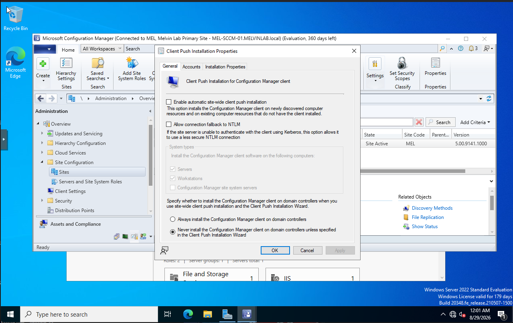

The General tab controls what types of machines the push will target. Checking "Enable automatic site-wide client push installation" turns on the behavior, and "Install Configuration Manager client software on domain controllers" was enabled on this tab so that MEL-DC-01 — which is a domain controller — would be eligible for enrollment. SCCM excludes domain controllers by default, so this checkbox is required for that machine to receive the client.

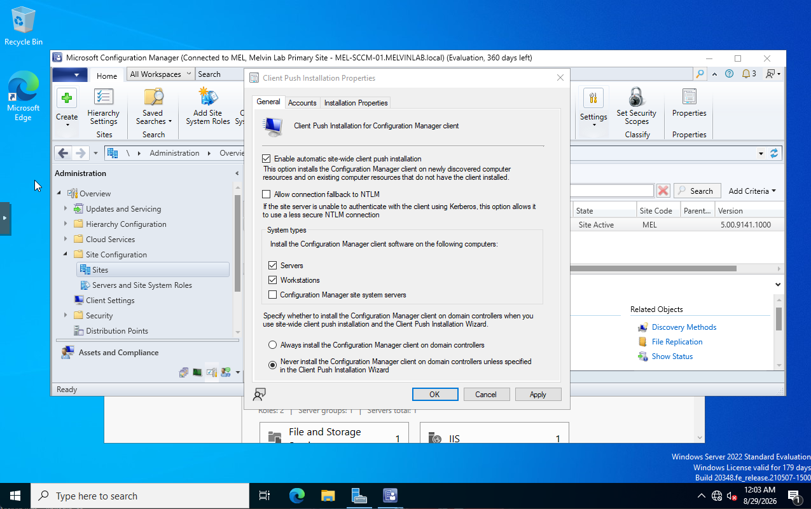

### Step 3 — Verifying Account Credentials

Before saving the configuration, the connection was tested to confirm that MELVINLAB\Administrator could authenticate against the domain. The test result came back successful, confirming that the credentials are valid and that SCCM will be able to reach target machines using that account when it executes the push.

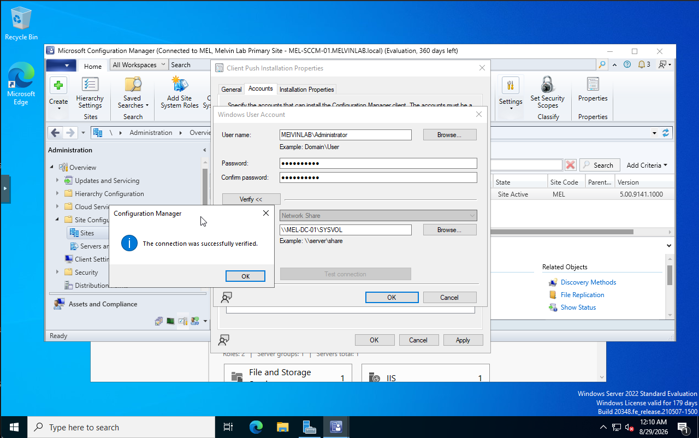

### Step 4 — Enabling Active Directory System Discovery

SCCM cannot push a client to a machine it does not know about. Active Directory System Discovery is the method that populates the console with computer accounts from the domain. Under Administration → Hierarchy Configuration → Discovery Methods, Active Directory System Discovery was enabled and the polling schedule was configured to run discovery on a regular interval.

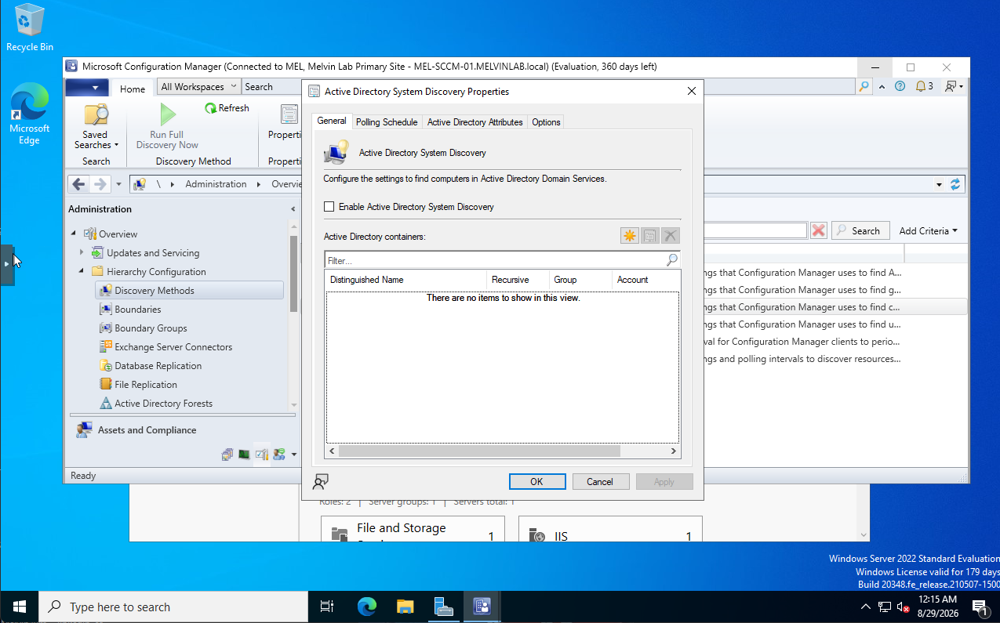

The discovery scope was set to the LDAP path `DC=MELVINLAB,DC=local`, telling SCCM to search the entire domain for computer objects. After saving, a full discovery cycle was triggered immediately so that MEL-DC-01 and MEL-CL-01 would appear in the console without waiting for the next scheduled run.

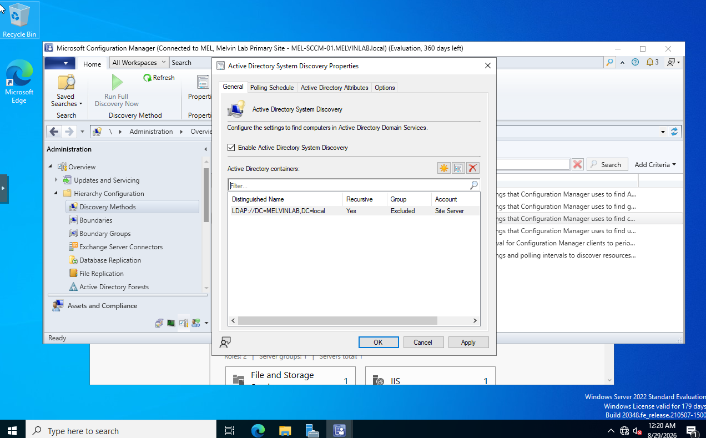

### Step 5 — Viewing Discovered Devices

After discovery completed, Assets and Compliance → Devices showed the machines that SCCM now knows about. MEL-DC-01 and MEL-CL-01 appeared in the list alongside MEL-SCCM-01. At this point the Client column is blank for both targets — they are discovered but not yet enrolled. Right-clicking each device and selecting Install Client opens the wizard to push the agent.

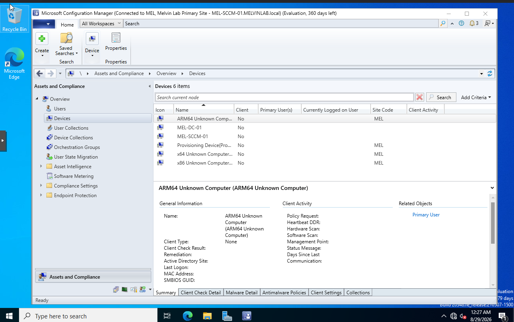

### Step 6 — Running the Client Installation Wizard

The Install Configuration Manager Client wizard was launched for MEL-DC-01 first, then repeated for MEL-CL-01. The Before You Begin page summarizes what the wizard will do: connect to the target machine using the configured push account, copy the client installation files, and execute the installer remotely. The defaults were accepted and the wizard was completed for both machines.

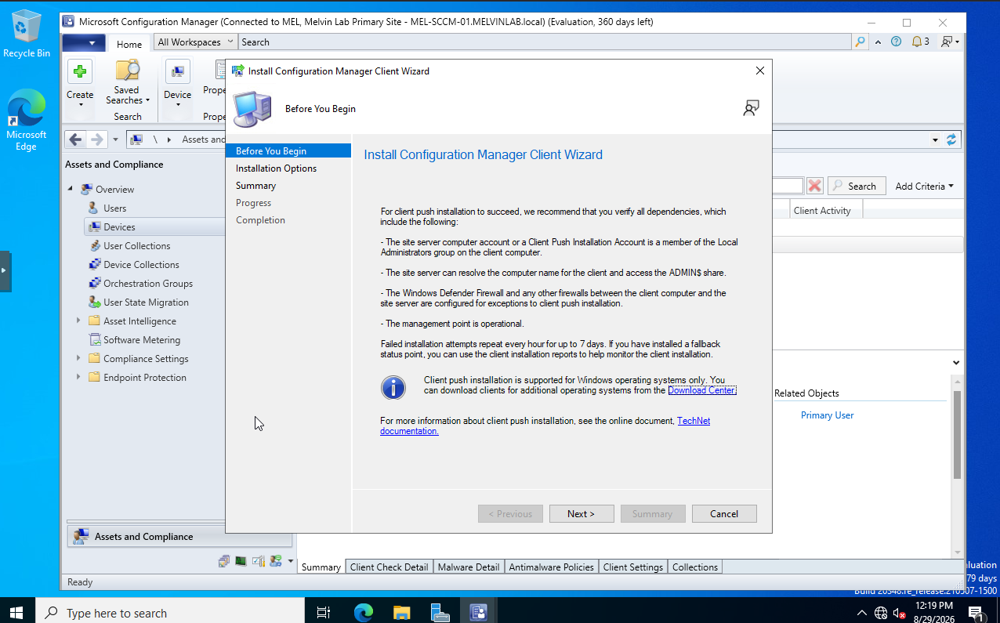

The wizard completed with a note about the SMS Client installation. This is expected behavior in environments where the client is being installed for the first time — the installation process itself succeeds and the client begins its initial setup cycle on the target machine. The wizard result is not an error that requires remediation.

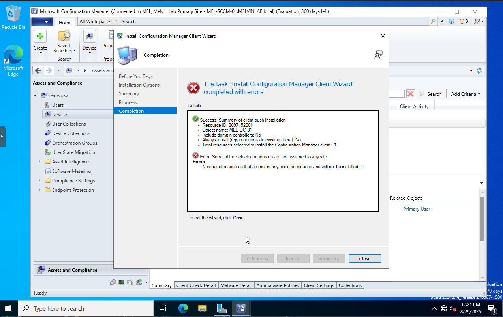

### Step 7 — Confirming Client Enrollment

After allowing time for the client to install and check in, the Devices list was refreshed. MEL-DC-01 and MEL-CL-01 both now show Client: Yes and Client Activity: Active, with site code MEL and client version 5.00.9141.1011. Both machines are enrolled, communicating with the site server, and ready for all subsequent support operations — inventory queries, remote control, and software deployment.

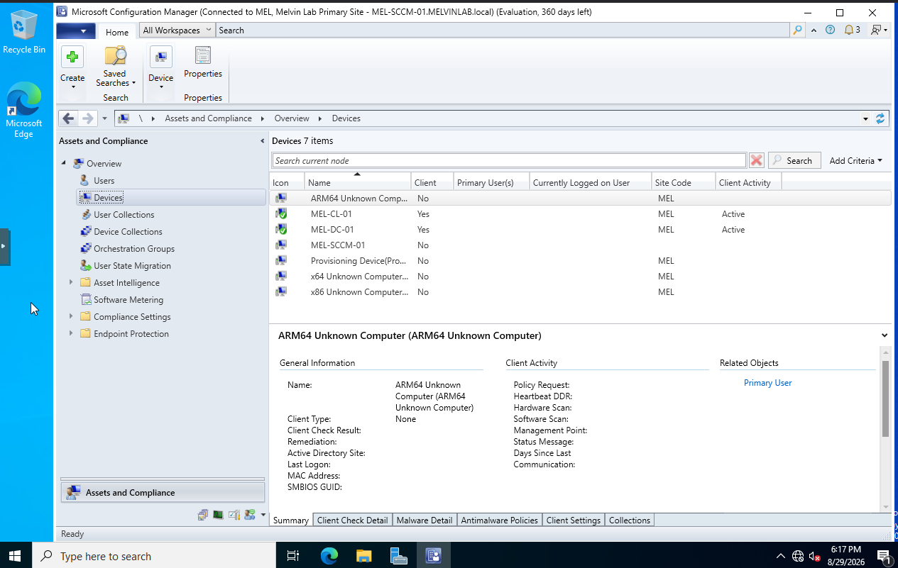

---

## Phase 2 — Device Lookup & Inventory

With clients enrolled and reporting in, the next task a support technician performs is looking up a device to understand what it is and what is running on it. SCCM collects this information automatically through hardware and software inventory cycles, and exposes it through a tool called Resource Explorer. This phase walks through using Resource Explorer to pull hardware data from MEL-CL-01, triggering a manual inventory cycle to force a refresh, and reviewing the data SCCM has collected across multiple hardware categories.

### Step 1 — Opening Resource Explorer

Resource Explorer is accessed by right-clicking any enrolled device in Assets and Compliance → Devices and selecting Start → Resource Explorer. This opens a separate window scoped to that device, with a tree on the left organized into Hardware, Hardware History, Software, and Diagnostic Files. All inventory data SCCM has ever collected about the machine lives here. MEL-CL-01 is the target throughout this phase since it is the workstation — the type of machine most support tickets will involve.

### Step 2 — Viewing Processor Data

Expanding Hardware and clicking Processor shows the CPU reported by the SCCM client on its last hardware inventory cycle. For MEL-CL-01, this is an Intel Core i7-8700T at 2.40GHz running on a 64-bit architecture. This is the same data a technician would use to verify specs before deploying resource-intensive software or troubleshooting performance complaints.

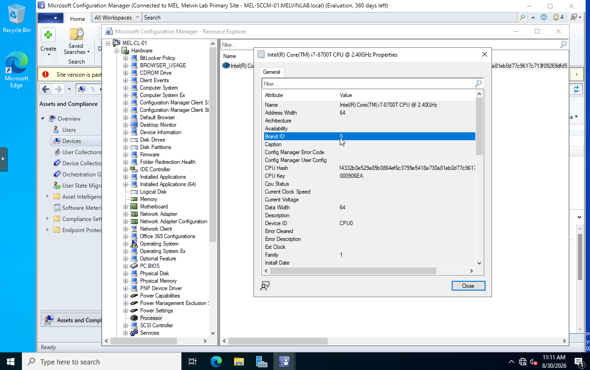

### Step 3 — Viewing Memory Data

Clicking Physical Memory in the left tree shows the RAM inventory for the machine — capacity, speed, and slot information as reported by WMI. This is useful for determining whether a device meets minimum memory requirements for a software package before attempting deployment.

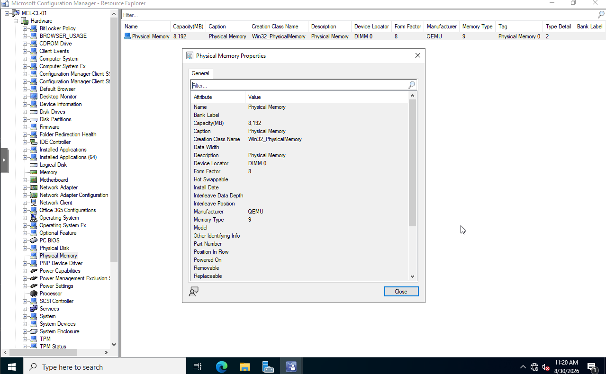

### Step 4 — Viewing Operating System Data

The Operating System node shows the exact OS version, build number, service pack level, and architecture. This is one of the most commonly referenced inventory categories in a support environment — knowing whether a machine is running Windows 10 or Windows 11, and which build, determines patch applicability, upgrade eligibility, and compatibility with enterprise software.

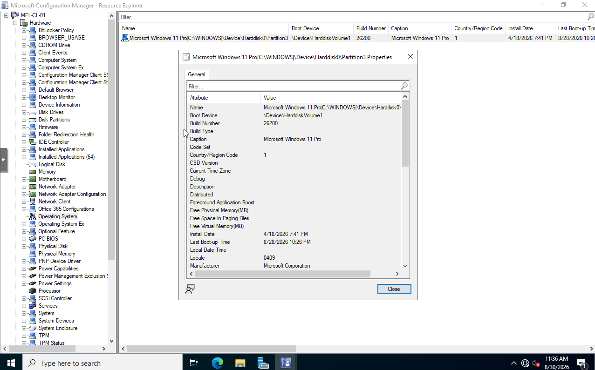

### Step 5 — Viewing Disk Data

The Disk Drives node shows the physical storage devices attached to the machine. For MEL-CL-01, SCCM reports a QEMU HARDDISK on the IDE interface with 2 partitions, reflecting the virtualized disk in the lab environment. In a production environment this view identifies drive model, interface type, and partition count — useful for storage capacity planning and troubleshooting disk-related issues.

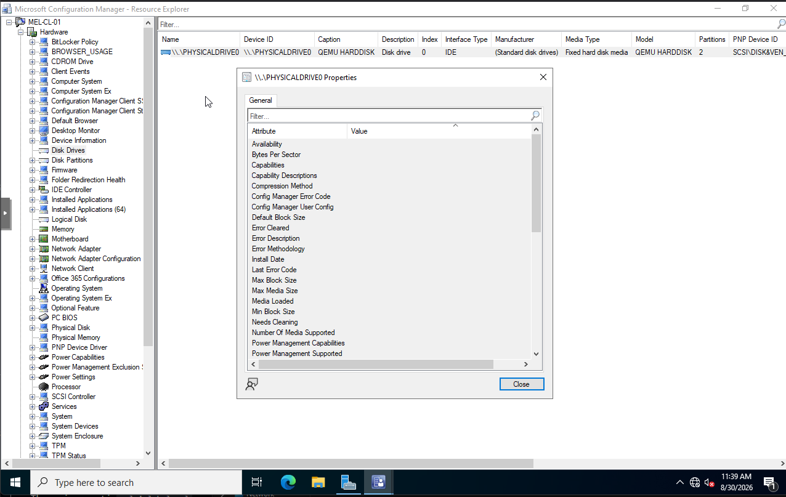

### Step 6 — Triggering a Manual Inventory Cycle and Viewing Installed Applications

Hardware inventory runs on a schedule, but it can be forced immediately using Client Notification. Right-clicking MEL-CL-01 in the Devices list and selecting Client Notification → Collect Hardware Inventory sends an instruction to the client to run its inventory cycle immediately and report back. After allowing a few minutes for the cycle to complete, Resource Explorer was refreshed. Installed Applications (64) now shows the 64-bit software installed on MEL-CL-01 as collected from the Windows registry — the same data a technician would use to verify software is present, check version numbers, or confirm a deployment succeeded.

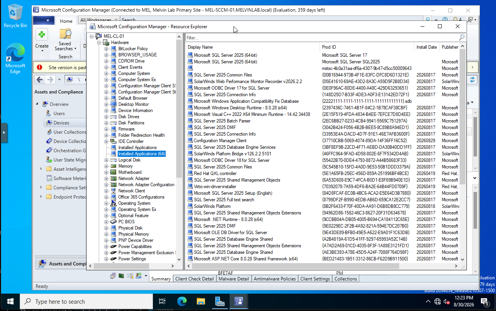

### Step 7 — Viewing Network Adapter Data

The Network Adapter node shows the network interfaces on the machine — adapter name, MAC address, IP address, and whether DHCP is enabled. This inventory is valuable for network troubleshooting, asset tracking, and confirming that the correct adapter is active on a machine.

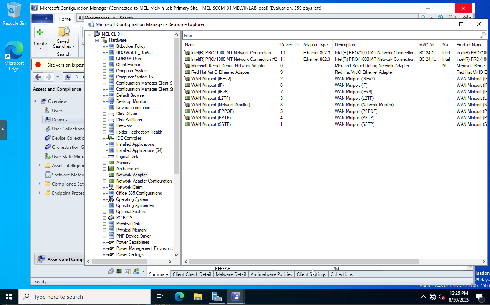

### Step 8 — Reviewing Device Collections

Device Collections are how SCCM groups machines for targeting. All Systems is the built-in collection that contains every enrolled device in the site. In Assets and Compliance → Device Collections, this collection confirms that MEL-CL-01 and MEL-DC-01 are both present and eligible to be targeted for deployments, remote actions, and compliance policies. Collections are the foundation of everything deployment-related in SCCM — nothing gets deployed to individual machines, only to collections.

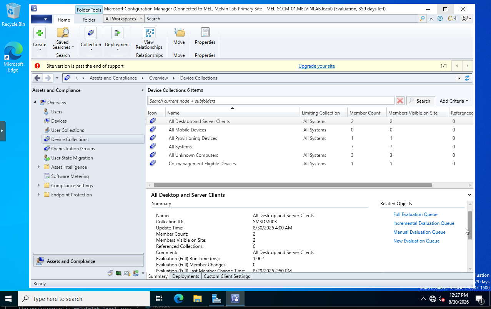

### Step 9 — Reviewing Client Properties

Right-clicking MEL-CL-01 and selecting Properties opens the client properties dialog. This shows the assigned site code (MEL), client version (5.00.9141.1011), last active time, and domain membership. This is the summary view a technician checks to confirm a machine is healthy — that it is assigned to the right site, running the expected client version, and has communicated recently.

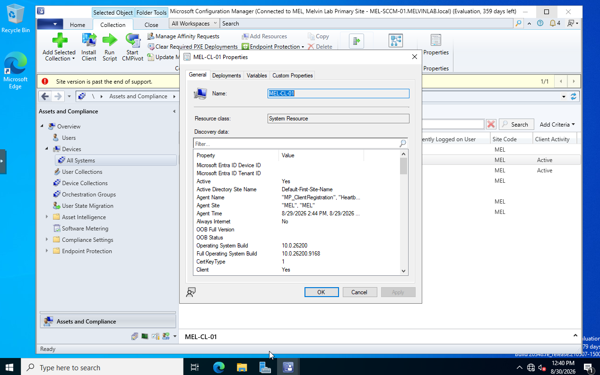

---

---

## Phase 3 — Remote Control

*This phase has not yet been documented.*

---

## Phase 4 — Software Deployment

*This phase has not yet been documented.*

---

## Phase 5 — Software Center (End-User View)

*This phase has not yet been documented.*
